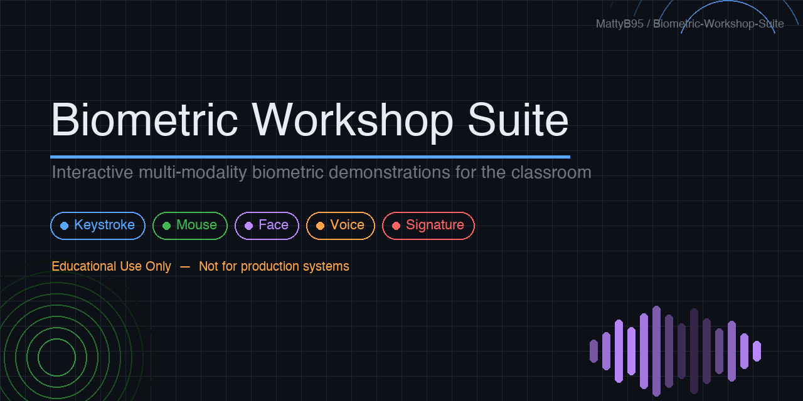

# Biometric Workshop Suite



[](https://github.com/MattyB95/Biometric-Workshop-Suite/actions/workflows/ci.yml)
[](https://mattyb95.github.io/Biometric-Workshop-Suite/documentation/)
[](https://github.com/MattyB95/Biometric-Workshop-Suite/actions/workflows/ci.yml)
[](https://www.python.org/)
[](LICENSE)
[](SECURITY.md)
[](https://mattyb95.github.io/Biometric-Workshop-Suite/)

[](https://github.com/sponsors/MattyB95)
[](https://ko-fi.com/mattyb95)
[](https://thanks.dev/u/gh/MattyB95)

An interactive, multi-modality biometric demonstration suite built for classroom and workshop use. Students enrol their biometric traits across five different techniques and see in real time how each system works — from feature extraction through to matching and identification.

> **⚠️ Educational Use Only**
>
> This project is designed exclusively for **education and training purposes**. The algorithms, storage, and architecture are intentionally simplified to make the concepts accessible and observable. This suite **must not** be used in any security-critical, production, or real-world authentication context. It provides no meaningful security guarantees and should never be used to protect real systems, data, or identities.

---

## Modules

| Module                    | Technique                  | Features extracted                             |
| ------------------------- | -------------------------- | ---------------------------------------------- |
| ⌨️ **Keystroke Dynamics** | Typing rhythm analysis     | Dwell time, flight time per character          |
| 🖱️ **Mouse Dynamics**     | Pointer movement profiling | Movement time, path curvature, click dwell     |
| 🧑 **Face Recognition**   | Geometric facial features  | 16 normalised landmark ratios (68-point model) |
| 🎙️ **Voice Biometrics**   | Speaker characterisation   | MFCC mean vector, pitch, spectrogram           |
| ✍️ **Signature Dynamics** | On-screen handwriting      | Duration, path length, velocity, stroke count  |

Every module supports **Enrol** and **Identify** (or Verify) with live visualisations so students can see exactly which features are being extracted and how the matching score is calculated.

---

## Requirements

- Python 3.14+
- [uv](https://docs.astral.sh/uv/) (recommended) or pip
- A modern web browser (Chrome or Firefox recommended)
- A webcam for the Face Recognition module
- A microphone for the Voice Biometrics module

---

## Quick Start

**1. Clone the repository**

```bash
git clone <repo-url>
cd Biometric-Workshop-Suite
```

**2. Install dependencies**

```bash
uv sync
```

**3. Run the server**

```bash
just run
```

**4. Open your browser**

```
http://localhost:5000
```

---

## Running a Workshop Session

### Before students arrive

1. Start the server on the presenter's machine.
2. Connect all student devices to the same network and point browsers at `http://<your-ip>:5000`.
   - Or use a single shared computer and take turns.
3. Navigate to **Instructor Admin** on the home page and enter the admin PIN to reset any profiles left from a previous session.

### General pattern for each module

1. Each student enters their name and **enrols** by performing the biometric action (typing, moving the mouse, speaking, etc.).
2. Once several students are enrolled, any student can press **Identify** — the system ranks all profiles by confidence and shows the best match.
3. Discuss the results as a group (see discussion prompts below).

### Module-specific notes

**Keystroke Dynamics**

- Students type `the quick brown fox` 5 times to build their profile. Encourage natural, consistent typing speed.
- The fixed phrase keeps all profiles comparable. Changing it mid-session requires re-enrolling everyone.

**Mouse Dynamics**

- Students click through 8 on-screen targets 5 times. Movement paths are visualised live.
- Results vary noticeably between a mouse and a trackpad — worth demonstrating.

**Face Recognition**

- Requires webcam access. One capture per student (single-sample enrolment).
- Uses facial geometry (ratios between landmarks), not pixel comparison — lighting affects results.

**Voice Biometrics**

- Students speak for a few seconds to enrol. A second recording is used for identification.
- Results are affected by background noise, microphone quality, and speaking style.

**Signature Dynamics**

- Students draw their signature on screen using a mouse, trackpad, or touchscreen.
- The system measures _how_ the signature is drawn (speed, pressure, stroke order), not just its shape.

### Discussion prompts

- Why does the system sometimes get it right / wrong?
- Which module felt most reliable? Why?
- What would an attacker need to do to fool each system?
- How do these techniques differ from passwords or PINs?
- What are the privacy implications of storing biometric data?
- Where are these techniques used in the real world?

---

## Admin Panel

An instructor admin page is available at `/admin` (or `admin.html` in the static version). It is PIN-protected to prevent students from accidentally or deliberately managing each other's profiles.

**Default PIN: `1965`**

From the admin panel the instructor can:

- View all enrolled profiles for every modality
- Delete individual profiles
- Reset all profiles for a specific modality
- Reset all profiles across all modalities at once (clean slate)
- Change the admin PIN

> To change the default PIN before a session, navigate to `/admin`, log in with `1965`, and use the **Change Admin PIN** form.

---

## How the Matching Works

### Keystroke & Mouse Dynamics

Profiles are built by computing the **mean** and **standard deviation** of each timing feature across multiple enrolment attempts. Identification uses a **normalised Manhattan distance**:

```
distance = mean over all features of  |sample − mean| / max(std, floor)
```

Features with low variance (consistent behaviour) are weighted more heavily. Distances are converted to confidence percentages via **softmax**.

### Face Recognition

16 geometric ratios are extracted from 68 facial landmarks detected by a TinyFace model (runs entirely in the browser). Identification uses **cosine similarity** between the enrolment vector and the live capture.

### Voice Biometrics

Short-time Fourier analysis produces a spectrogram, from which **Mel-Frequency Cepstral Coefficients (MFCCs)** are extracted per frame. The mean MFCC vector across the recording forms the profile. Identification uses **cosine similarity**.

### Signature Dynamics

Six scalar features are extracted from the stroke data: total duration, normalised path length, average velocity, peak velocity, stroke count, and direction-change rate. Identification uses a **weighted Euclidean distance** normalised per feature.

---

## Configuration

Open `src/app.py` and edit the constants near the top:

| Variable                        | Default                 | Description                                   |
| ------------------------------- | ----------------------- | --------------------------------------------- |
| `PHRASE`                        | `"the quick brown fox"` | The phrase typed in the Keystroke module      |
| `ENROLL_SAMPLES_REQUIRED`       | `5`                     | Keystroke enrolment attempts required         |
| `MOUSE_ENROLL_SAMPLES_REQUIRED` | `5`                     | Mouse enrolment attempts required             |
| `DEFAULT_ADMIN_PIN`             | `"1965"`                | Fallback PIN if `admin_config.json` is absent |

The admin PIN can also be changed at runtime via the admin panel without restarting the server.

---

## Hosting Options

### Option A — GitHub Pages (static, no server needed)

The `docs/` folder is a fully self-contained static version — all logic runs in JavaScript and all profiles are stored in the browser's `localStorage`. No Python or server required.

The included GitHub Actions workflow (`.github/workflows/docs.yml`) automatically deploys both the static app and the MkDocs documentation to GitHub Pages on every push to `main`.

1. Push the repository to GitHub.
2. Go to **Settings → Pages**, set source to **GitHub Actions**.
3. Your suite will be live at `https://<username>.github.io/<repo-name>/` and the documentation at `https://<username>.github.io/<repo-name>/documentation/`.

> **Note:** In the static version, each student's data is stored in _their own browser_. The admin page on the static version can only manage data on the device where it is opened. For a shared server where all students connect to the same backend, use Option B or C.

---

### Option B — Render (hosted Flask app, shared across devices)

The Flask version stores all profiles on the server — all students share the same profile store in real time. Ideal when students each have their own device.

1. Push the repository to GitHub.
2. Sign up at [render.com](https://render.com) and click **New → Web Service**.
3. Connect your repository. Render will detect `render.yaml` and configure everything automatically.
4. Click **Deploy** and share the URL with students.

> **Note:** Render's free tier spins down after 15 minutes of inactivity — the first request after a sleep may take ~30 seconds. Profile data stored on disk will be reset on each redeploy.

To run in production mode locally (mirrors the Render environment):

```bash
just serve
```

---

### Option C — Local network (no deployment required)

The simplest option for a classroom: run the server on the presenter's machine and share the local IP address.

```bash
just run-network
```

Then share `http://<your-local-ip>:5000` with students on the same Wi-Fi. No accounts, deployment, or internet connection needed.

---

## Project Structure

```
.
├── src/
│   └── app.py                   # Flask backend — routes, APIs, matching algorithms
├── templates/
│   ├── home.html                # Landing page
│   ├── admin.html               # PIN-protected instructor admin panel
│   ├── keystroke.html           # Keystroke dynamics module
│   ├── mouse.html               # Mouse dynamics module
│   ├── face.html                # Face recognition module
│   ├── voice.html               # Voice biometrics module
│   └── signature.html           # Signature dynamics module
├── docs/                        # Fully static version (GitHub Pages)
│   ├── index.html
│   ├── admin.html
│   ├── keystroke.html
│   ├── mouse.html
│   ├── face.html
│   ├── voice.html
│   └── signature.html
├── tests/                       # pytest + Playwright test suite
├── profiles.json                # Keystroke profiles (auto-created)
├── mouse_profiles.json          # Mouse profiles (auto-created)
├── face_profiles.json           # Face profiles (auto-created)
├── voice_profiles.json          # Voice profiles (auto-created)
├── signature_profiles.json      # Signature profiles (auto-created)
├── admin_config.json            # Admin PIN storage (auto-created)
├── render.yaml                  # Render deployment config
├── justfile                     # Task runner shortcuts
└── pyproject.toml               # Project metadata and dependencies
```

---

## Troubleshooting

| Problem                                               | Solution                                                                                                |
| ----------------------------------------------------- | ------------------------------------------------------------------------------------------------------- |
| Wrong key resets the keystroke attempt                | Type carefully — the phrase must be typed exactly as shown                                              |
| Keystroke/mouse results always favour the same person | Ensure at least 3–4 students have enrolled before identifying                                           |
| Identification seems random                           | Try enrolling with more consistent speed and technique                                                  |
| Server not reachable from other devices               | Use `just run-network` or ensure `host="0.0.0.0"` in `src/app.py`                                       |
| Camera not working (Face module)                      | Check browser permissions — the page needs webcam access                                                |
| Microphone not working (Voice module)                 | Check browser permissions and ensure no other app holds the mic                                         |
| Face model fails to load                              | The model files in `static/models/` must be accessible — check the browser console for 404 errors       |
| Admin PIN forgotten                                   | Delete `admin_config.json` from the project root; the default PIN `1965` will be restored on next start |

---

## Support

If you find this project useful for your teaching or workshops, consider buying me a coffee — it helps cover hosting costs and motivates continued development.

[](https://github.com/sponsors/MattyB95)
[](https://ko-fi.com/mattyb95)
[](https://thanks.dev/u/gh/MattyB95)

---

## Licence

This project is released for educational use. See `LICENSE` for details.
